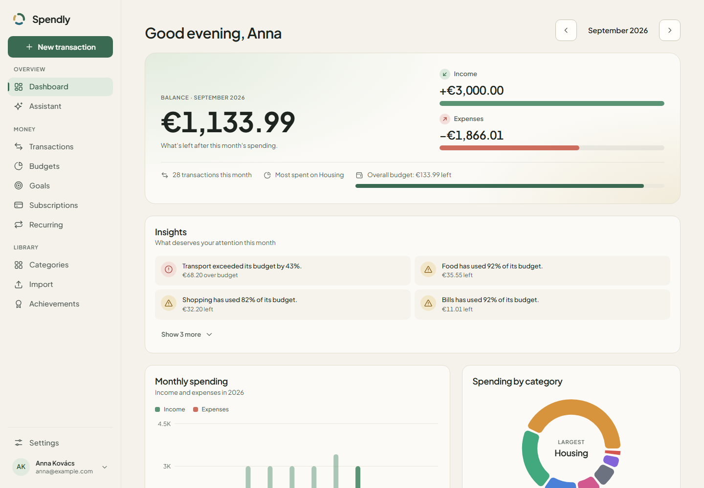
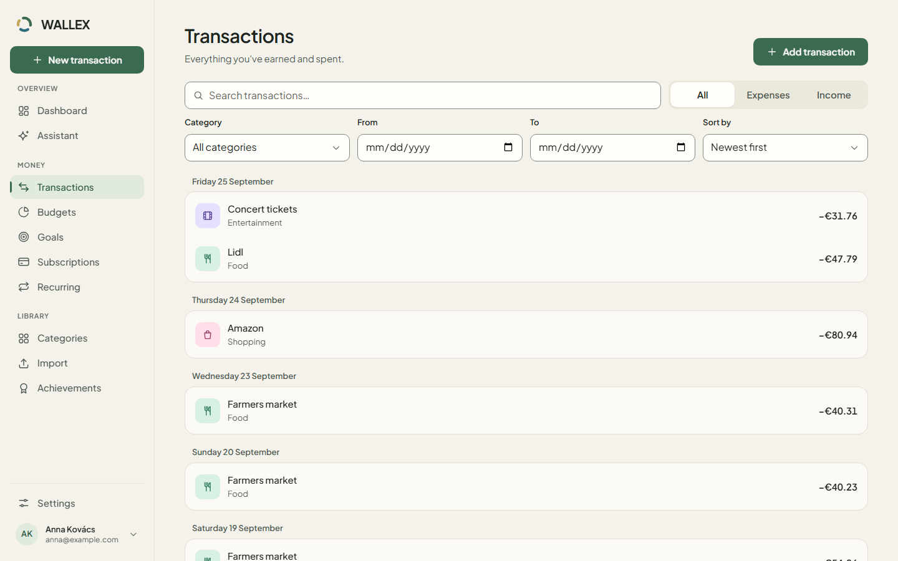
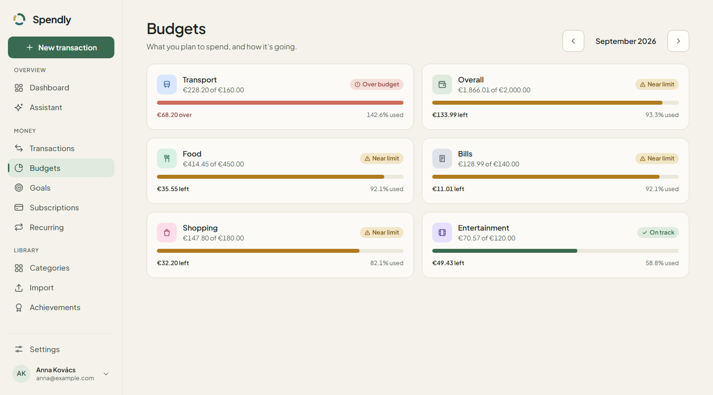
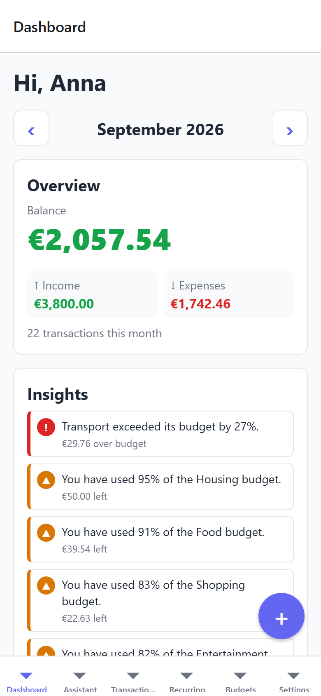
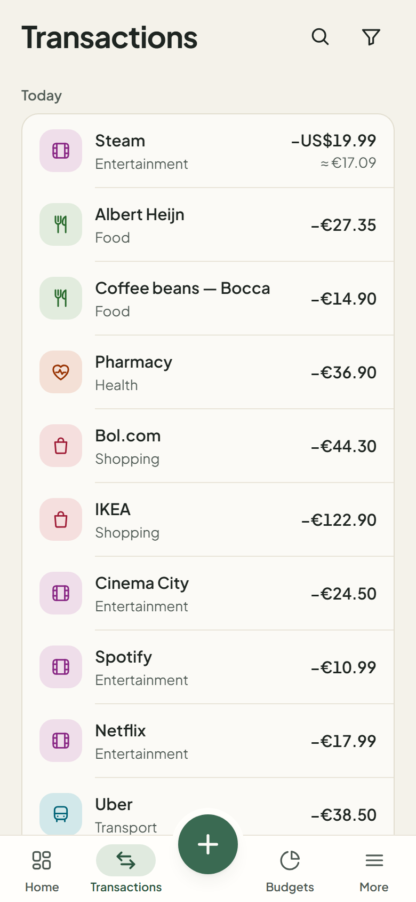
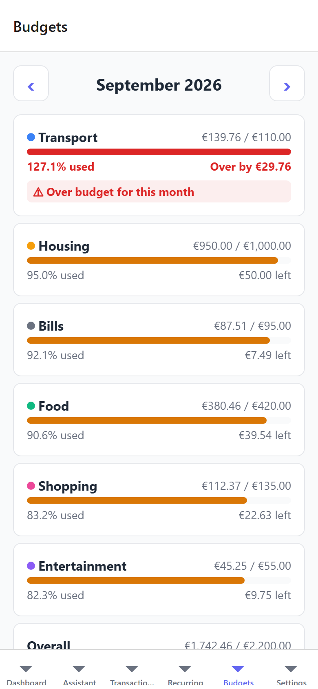
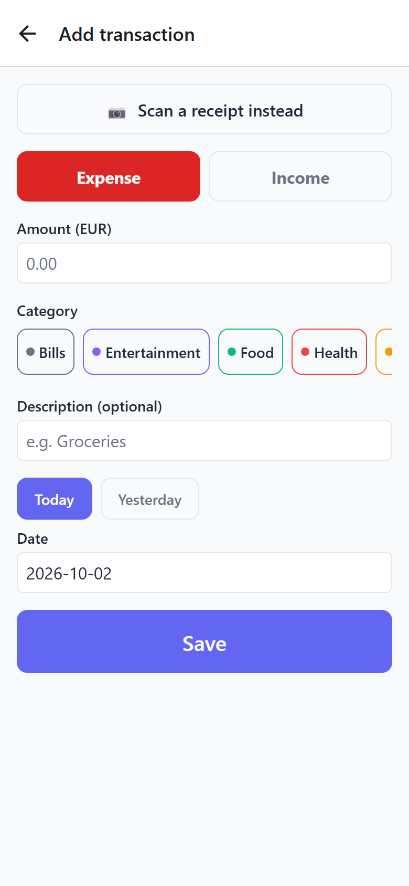
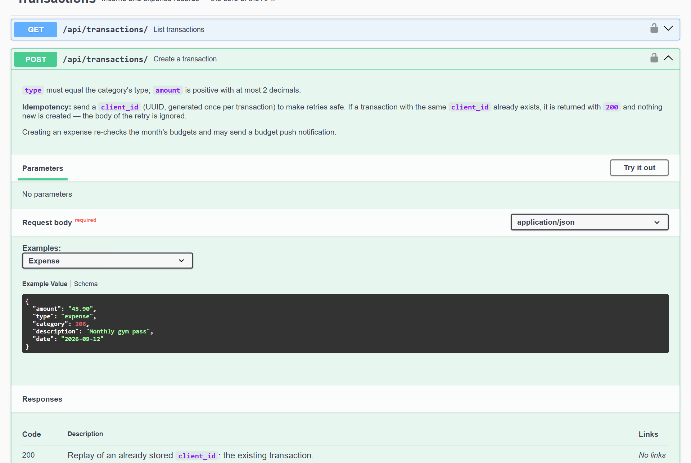
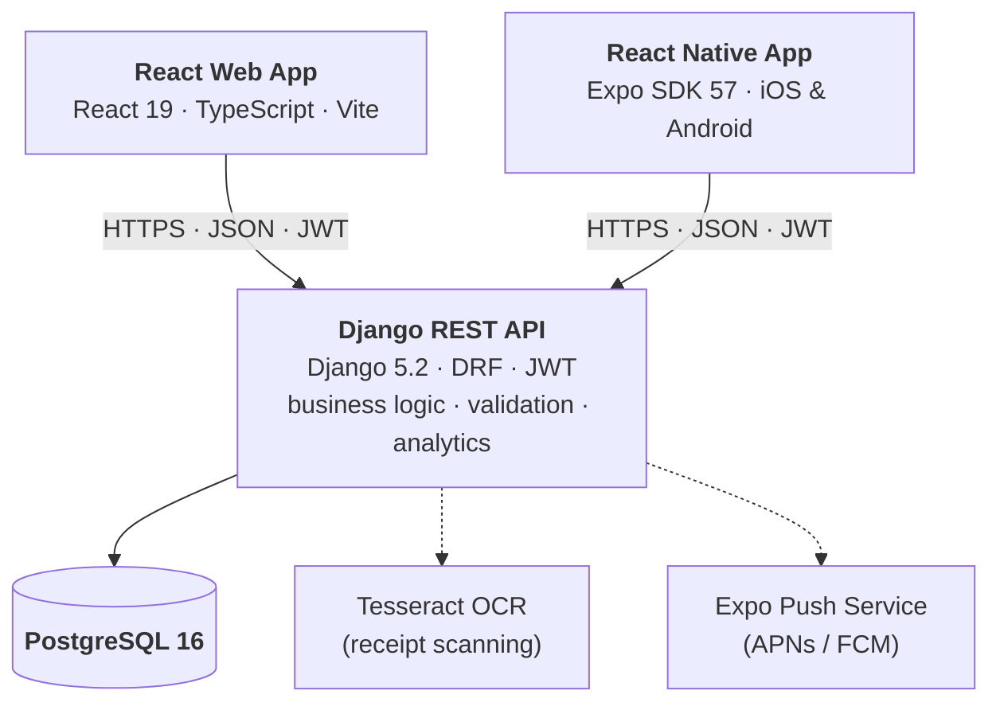
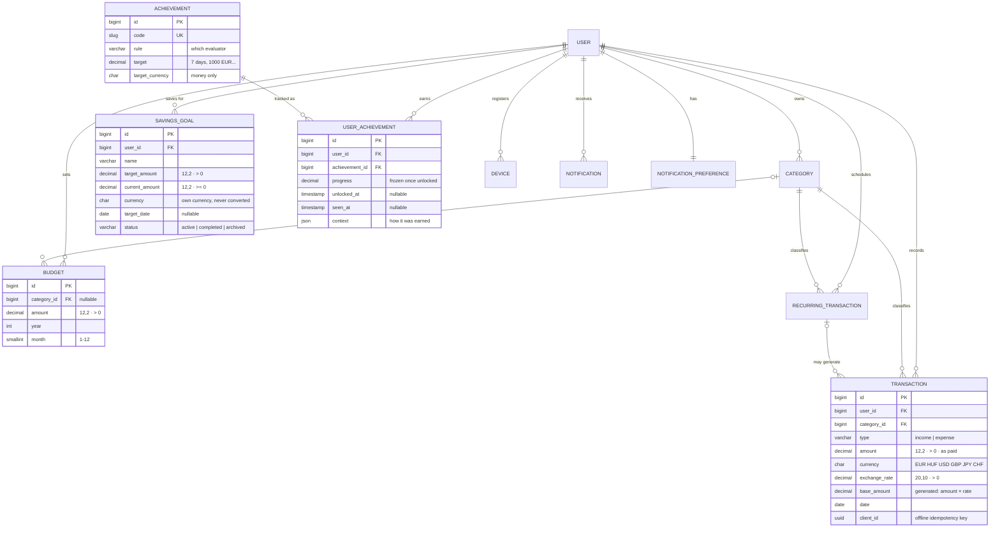

# Spendly – Personal Finance Platform

**Track spending, set budgets and understand your money — on the web, iOS and Android, backed by one API.**




Spendly is a full-stack personal finance app built as a production-style portfolio project.

- **One backend for every client.** A Django REST API holds all business logic, validation
  and financial calculations.
- **Three clients:** a React web app and a React Native (Expo) app for iOS and Android.
- **Beyond CRUD:** rule-based financial insights, receipt scanning with OCR, offline support,
  push notifications and biometric app lock.

---

## Contents

- [Overview](#overview)
- [Features](#features)
- [Screenshots](#screenshots)
- [Architecture](#architecture)
- [Tech stack](#tech-stack)
- [Web application](#web-application)
- [iOS & Android application](#ios--android-application)
- [API](#api)
- [Database](#database)
- [Authentication](#authentication)
- [Docker](#docker)
- [Testing](#testing)
- [Installation](#installation)
- [Deployment](#deployment)
- [Security](#security)
- [Project structure](#project-structure)
- [Documentation](#documentation)
- [Future improvements](#future-improvements)

---

## Overview

| | |
|---|---|
| **Problem** | Everyday spending is scattered across card payments, cash and subscriptions; overspending is noticed too late. |
| **Solution** | Record transactions in seconds (or scan the receipt), set monthly budgets, and get a dashboard plus plain-language insights that point out what changed. |
| **Platforms** | Web (desktop-oriented), iOS and Android (one React Native codebase). |
| **Principle** | The backend is the single source of truth: clients never compute totals, budgets or insights themselves — they display what the API returns. |

Design goals:

- Correctness around money: exact decimals end to end, never floats.
- Strict per-user data isolation.
- Tests for the risks that matter.
- A setup that runs with one `docker compose` command.

## Features

### Core (all platforms)

- **Transactions:** create, edit and delete income and expenses; search, filter (type,
  category, date range), sort and paginate.
- **Categories:** 10 defaults seeded per user, plus custom categories with colours and icons.
  A category still in use can't be deleted.
- **Budgets:** monthly limits per category, or overall. Spent, remaining and usage are
  computed live; there are warning (≥ 80 %) and over-budget states.
- **Recurring transactions:** weekly, monthly or yearly templates for rent, salary and
  bills, billed in their own currency. They can be paused and drive payment reminders.
- **Subscription manager:** Netflix, Spotify, Adobe, gym, internet, phone, insurance… with
  merchant, currency, billing period, first/last payment and pause. The server computes each
  one's monthly and yearly cost (weekly = 52 payments a year), the next payment dates, the
  totals in the base currency (e.g. *Monthly subscriptions: €95.96 · Yearly projection:
  €1,151.52*), a per-category split and the next 30 days' payments. A subscription is a
  recurring expense — the same database row, not a parallel system — so reminders, insights
  and fixed-expense detection include it automatically.
- **Savings goals:** several goals per user (e.g. *Japan trip: €1,850 of €3,000, 61.7 %*),
  each in its own currency with an optional target date. Money is added and removed through
  atomic server-side actions (row-locked, never below zero); the server computes progress, the
  amount still to save, days left and how much to put aside each month. A goal completes
  itself when the target is reached and can be archived. Putting money aside isn't an
  expense, so goals don't touch transactions or budgets.
- **Achievements:** quiet milestones for motivation — *🔥 7 Day Tracking Streak*, *🏆 €1,000
  Saved*, *🎯 Stayed Under Food Budget*, first transaction, 30-day streak, completed savings
  goal. Evaluated on the server from existing data (the savings total, the budgets' own
  over-budget rule), stored with progress and unlock time, and permanent once earned. The
  catalog is data: a new milestone on an existing rule is one migration row.
- **Analytics:** a monthly dashboard, a 12-month income/expense trend, spending by category,
  plus a spending analysis section:
  - rolling monthly and per-category trends with each month's change,
  - month-over-month **and** year-over-year comparison, per category too,
  - top merchants (total, count, average, share, change),
  - average daily spending, spending by weekday, fixed vs variable expenses,
  - budget variance: over/under the limit and whether spending keeps pace with the month.

  All of it is computed in the database with grouped queries (1–3 per endpoint, however much
  data there is).
- **Financial insights:** 8 rule types, e.g. budget exceeded/warning, overspending, savings
  rate, category spikes and drops, recurring share of income, top category.
- **Smart notifications:** the server watches the user's own data and writes each message —
  *You've used 82% of your Food budget*, *Netflix payment expected tomorrow*, *Your Shopping
  expenses increased by 21%*, *You are €150 away from your Japan trip goal*, a monthly
  summary, and important insights. Budget and savings checks run the moment the data
  changes; the rest run from an hourly, idempotent job. Every event notifies once, each of
  the 8 kinds can be switched off, and notifications keep a read/unread state and a link to
  what they're about. The clients only display them.
- **Multi-device sync:** web, iPhone and Android share one account through the same API and
  database. A transaction added on the phone appears on the open web page (and the reverse)
  without a reload: each client asks a cheap `GET /api/sync/status/` every 30 s while visible,
  when it comes back to the foreground and after its own writes, then refreshes what's on
  screen in the background. Edits carry the version they started from (`If-Match`), so a
  stale edit on one device can never silently overwrite a newer one: the user sees the other
  device's version instead. API responses are never cached.
- **AI finance assistant:** a chat (web and mobile, one API) that answers questions such as
  *What did I spend the most on this month?*, *Why did my spending go up?* or *How am I doing
  with my Japan trip goal?*. The model (Claude, via the official Anthropic SDK) never touches
  the database: it can only call seven read-only backend tools — monthly spending, spending by
  category and by merchant, budget status, subscription costs, savings progress, month
  comparison — which reuse the dashboard's services for the signed-in user and return
  aggregated figures without ids, name or e-mail. Answers must come from those results; when
  they aren't enough the assistant says *"Nem áll rendelkezésre elegendő adat."* (or the English
  equivalent) instead of guessing, and every answer lists the data it was based on. The server
  keeps the conversation history (text only, never the tool results), suggests questions from
  the user's own data, and is off unless `ANTHROPIC_API_KEY` is set.
- **Multi-currency:** EUR, HUF, USD, GBP, JPY and CHF. A transaction keeps the amount and
  currency it was paid in; its value in the user's base currency is fixed with the ECB
  reference rate of its date. Every total is in the base currency, and changing the base
  currency converts the whole history at historical rates.

### Web only

- **CSV import** of bank exports:
  - automatic categorisation from the description,
  - duplicate detection,
  - a per-row success/skip/failure report.

### Mobile only (iOS & Android)

- **Receipt scanning:** take or pick a photo. The server reads merchant, total, date,
  currency and the purchased items with OCR (English and Hungarian; the engine is swappable)
  and suggests a category. A confirmation screen shows merchant, amount, currency, date and
  category for the user to correct, and only **Save Transaction** creates the transaction —
  through the normal Transaction API, offline-safe. Unusable photos, OCR outages, non-receipts
  and receipts in unsupported currencies each get their own explanation and next step
  (retake, another photo, or manual entry).
- **Offline mode:**
  - cached screens stay readable without a connection,
  - new transactions are queued and synced automatically (idempotent, never duplicated).
- **Push notifications:** every smart notification also arrives as a push; a tap opens the
  related screen.
- **Biometric lock:** Face ID or fingerprint. The app locks again after 60 s in the background.
- **Secure token storage:** the refresh token is kept in the iOS Keychain / Android Keystore.

## Screenshots

**Web: transactions and budgets**




**Mobile: dashboard, transactions, budgets, quick add**

<p>
  
  
  
  
</p>

<sub>The mobile screenshots come from the Expo web target at iPhone size; the iOS and Android
builds render the same React Native screens natively. All data shown is generated demo data.</sub>

**Interactive API documentation (Swagger UI)**



## Architecture



- **Thin clients, one brain.**
  - Validation, ownership checks, money arithmetic, analytics and insights live only in
    the backend.
  - The web and mobile apps are API clients with their own UI, storage and navigation.
  - Money arrives as decimal strings and is never recalculated client-side.
- **Backend layering:** views (HTTP, permissions, rate limits) → serializers (input
  validation) → services (business logic, no HTTP) → models (constraints).
  - Heavy queries run in a fixed number of queries; tests assert the query counts, so no
    N+1 queries.
  - External systems (OCR, push) sit behind small interfaces and can be swapped.
- **Every row belongs to a user.** Querysets are always scoped to `request.user`, and an
  object-level permission adds a second check. Another user's objects answer `404`, so
  their existence is never revealed.
- **Production topology:** nginx serves the web build and proxies `/api/` to gunicorn on
  the same origin. This means one TLS certificate and no CORS. The mobile apps call the
  same `https://<host>/api/`.

## Tech stack

| Layer | Technologies |
|---|---|
| **Backend** | Python 3.13, Django 5.2 LTS, Django REST Framework 3.18, SimpleJWT (rotation + blacklist), django-filter, drf-spectacular (OpenAPI), Pillow + Tesseract 5 (OCR), gunicorn, WhiteNoise |
| **Database** | PostgreSQL 16 |
| **Web** | React 19, TypeScript (strict), Vite 8, React Router 7, Axios, Recharts 3, SCSS modules |
| **Mobile** | React Native 0.86, Expo SDK 57, Expo Router, expo-secure-store, expo-local-authentication, expo-notifications, expo-image-picker, AsyncStorage |
| **Testing** | pytest + pytest-django, Vitest + React Testing Library + MSW, Jest (jest-expo) + React Native Testing Library, jsonschema contract tests |
| **Infrastructure** | Docker, Docker Compose, nginx (unprivileged), EAS Build / Submit |

## Web application

A desktop-oriented single-page app (it also works on phones). Main parts:

| Page | What it does |
|---|---|
| **Dashboard** | Income / expenses / balance, insights, monthly trend chart, category donut, budget overview, top categories, recent transactions. Each section loads and fails independently with its own retry. |
| **Transactions** | Table with search, type/category/date filters, sortable columns, pagination, add/edit modal, delete confirmation. |
| **Budgets** | Month navigator, usage bars with warning / over-budget states, create/edit/delete. |
| **Recurring** | Manage recurring templates; pause and resume them. |
| **Subscriptions** | Monthly total and yearly projection, table with each subscription's price, monthly cost and next payment, add/edit/delete, next 30 days' payments, cost by category, and a details page per subscription. The dashboard has a card with the month's subscription costs. |
| **Achievements** | Unlocked, in-progress and not-started milestones with progress and unlock date; new ones are marked "New" once. The dashboard shows the latest unlocks and the next milestone. |
| **Goals** | Savings goals as cards with progress bars and target dates; total saved and overall progress; create/edit/delete, add and remove money, archive/restore; a details page with the amount still to save and the monthly plan. The dashboard shows *Savings progress*. |
| **Import** | Upload a bank CSV and review the per-row import report. |
| **Settings** | Profile and logout. |

A few implementation details:

- **Typed services:** one module per API resource, on top of an Axios client that attaches
  the access token and refreshes it once on `401`. Concurrent requests share a single
  refresh call, which matters because refresh tokens rotate.
- **Build hardening:** a Content-Security-Policy is injected at build time, and nginx sends
  the clickjacking and security headers.

## iOS & Android application

One Expo / React Native codebase produces both native apps (file-based routing with Expo
Router). The platform differences are handled by Expo modules:

| | iOS | Android |
|---|---|---|
| Token storage | Keychain (`WHEN_UNLOCKED_THIS_DEVICE_ONLY`) | Keystore-backed encrypted storage |
| Biometric lock | Face ID / Touch ID | Fingerprint / face (strong biometrics only) |
| Push delivery | APNs via Expo Push | FCM v1 via Expo Push |
| Permissions | Camera, photos, Face ID; each with a usage description | Camera, biometrics, notifications; unused permissions removed (microphone, storage, overlay) |
| Distribution | TestFlight → App Store | Internal testing → Google Play |

- **Build variants:** `development`, `preview` and `production`. Each has its own name and
  bundle ID, so all three can be installed side by side.
- **Build-time check:** a release build won't start building without an `https` API URL.
- **No secrets in the app:** the only build-time setting is the public API URL. Signing
  keys and push credentials live in EAS.
- **Guides:** [docs/mobile-release.md](docs/mobile-release.md) covers development builds,
  preview builds, production builds, and store submission for both platforms.

## API

- **Style:** RESTful JSON under `/api/`, 61 operations.
- **Reference:** a complete **OpenAPI 3** document generated from the code, covering every
  endpoint's request, response, validation errors and status codes.
  - Interactive Swagger UI at **`/api/docs/`** (dev server: http://localhost:8000/api/docs/).
  - Static file: [`backend/openapi.yaml`](backend/openapi.yaml), which can be imported into
    Postman or Insomnia.

| Area | Endpoints |
|---|---|
| Authentication | `POST /api/auth/register/` · `login/` · `login/verify/` (2FA) · `refresh/` · `logout/` · `GET PATCH /api/auth/me/` |
| Account security | `POST /api/auth/logout-all/` · `GET /api/auth/sessions/` · `DELETE …/{id}/` · `POST /api/auth/password/` · `GET /api/auth/2fa/` · `POST …/2fa/setup/ confirm/ disable/ recovery-codes/` · `GET /api/auth/security-events/` |
| Transactions | `GET POST /api/transactions/` · `GET PUT PATCH DELETE /api/transactions/{id}/` |
| CSV import | `POST /api/transactions/import/` |
| Categories | `GET POST /api/categories/` · `GET PATCH DELETE /api/categories/{id}/` |
| Budgets | `GET POST /api/budgets/` · `GET PATCH DELETE /api/budgets/{id}/` |
| Recurring | `GET POST /api/recurring-transactions/` · `GET PATCH DELETE …/{id}/` |
| Subscriptions | `GET POST /api/subscriptions/` · `GET PATCH DELETE …/{id}/` · `GET …/summary/` |
| Savings goals | `GET POST /api/savings-goals/` · `GET PATCH DELETE …/{id}/` · `POST …/{id}/deposit/` · `POST …/{id}/withdraw/` · `GET …/summary/` |
| Analytics | `GET /api/analytics/dashboard/` · `monthly/` · `categories/` · `comparison/` · `trends/` · `merchants/` · `spending-patterns/` |
| Insights | `GET /api/analytics/insights/` |
| Achievements | `GET /api/achievements/` · `POST /api/achievements/mark-seen/` |
| Currencies | `GET /api/currencies/convert/` (conversion preview with ECB rates) |
| Receipts | `POST /api/receipts/scan/` (multipart photo → suggestions, nothing saved) |
| Notifications | `GET /api/notifications/` · `GET PATCH …/{id}/` · `GET …/unread-count/` · `POST …/mark-all-read/` · `GET PATCH …/preferences/` · `GET POST /api/devices/` · `DELETE /api/devices/{id}/` |
| Sync | `GET /api/sync/status/` (has anything changed?) · `ETag` / `If-Match` → `412` on every editable object |
| Health | `GET /api/health/` (liveness) · `GET /api/health/ready/` (database + cache) |

**Conventions:**

- Money is a decimal string (`"45.90"`) and amounts are always positive: `type` gives the
  direction.
- Errors use one consistent shape: `{"field": ["message"]}` for validation, `{"detail": "…"}`
  for everything else.
- Only the transaction list is paginated.
- Rate limits are per IP on auth endpoints and per user elsewhere.

```bash
curl -X POST http://localhost:8000/api/auth/login/ -H "Content-Type: application/json" \
  -d '{"email": "you@example.com", "password": "your-password"}'
curl "http://localhost:8000/api/analytics/dashboard/?year=2026&month=9" -H "Authorization: Bearer <access>"
```

## Database

PostgreSQL 16, modelled with Django's ORM. Every table carries a direct `user_id`, and every
query starts from it.



- **Integrity lives in the database, not just the app:**
  - `CHECK` constraints on amounts and month ranges,
  - unique constraints: a category name per user and type, a budget per category and month,
    a transaction per `client_id`, and a case-insensitive email.
- **Serializers turn constraint violations into clean `400` responses**, not `500`s.
- **Subscriptions have no table of their own:** `Subscription` is a Django *proxy* of
  `RecurringTransaction` (rows with `is_subscription = true`, and a `CHECK` that they are
  expenses), so every feature built on recurring transactions sees them too.
- **Indexes match the real queries:** `(user, date)`, `(user, type)`, `(user, year, month)`
  and more.
- **Migrations are a release step:** a one-off `migrate` job runs them, never the app
  containers themselves.

## Authentication

JWT access and refresh tokens (SimpleJWT):

| Token | Lifetime | Notes |
|---|---|---|
| Access | 15 min | Sent as `Authorization: Bearer …` on every request. |
| Refresh | 7 days | **Rotated** on every use; the old one is blacklisted immediately. Logout revokes it server-side. |

- **Login:** email (case-insensitive) and password; Django's password validators apply at
  registration.
- **Rate limits:** login, registration and refresh are limited per client IP.
- **Mobile:**
  - The refresh token is stored in the Keychain / Keystore; the access token exists only in
    memory.
  - The access token is refreshed proactively before it expires.
  - A session that can't reach the server is kept rather than dropped.
  - An optional biometric lock gates the app.
- **Web:** the refresh token is an `HttpOnly`, `Secure`, `SameSite=Strict` cookie that page
  scripts can never read; the access token lives only in memory, and a reload gets a new one
  from the cookie.
- **Sessions:** every sign-in is a session tied to its device. Signing a device out, or out
  everywhere, stops its tokens on the very next request; a reused refresh token revokes the
  whole session as a precaution.

## Docker

Two compose files, one per purpose:

| File | Services | Use |
|---|---|---|
| `docker-compose.yml` | `db` (PostgreSQL), `backend` (Django `runserver`, auto-reload) | Local development |
| `docker-compose.prod.yml` | `postgres`, `migrate` (one-off release job), `backend` (gunicorn), `web` (nginx: React build + API proxy) | Production-like stack |

Production images:

- **Backend:** multi-stage Dockerfile with a `dev` target (test tools) and a `prod` target
  (gunicorn, static files collected at build time, WhiteNoise). Runs as a non-root user.
- **Web:** a Node build stage, then an unprivileged nginx runtime with SPA routing, caching
  headers, security headers and a same-origin API proxy.
- **Health checks** on every service. The startup order is postgres → migrate → backend → web.

## Testing

| Suite | Tools | Tests |
|---|---|---|
| Backend | pytest, pytest-django | **637** |
| Web | Vitest, React Testing Library, MSW | **49** |
| Mobile | Jest (jest-expo), React Native Testing Library | **92** |

The testing is risk-based rather than aimed at a coverage number
([strategy](docs/testing-strategy.md)). Highlights:

- **Security matrix:** introspects the URL configuration, so every endpoint must reject
  anonymous requests and hide other users' objects. A new endpoint can't forget it.
- **Money:** exact decimals end to end; money never appears as a float in any response.
- **API contract:** real responses of all 45 operations, errors included, are validated
  strictly against the OpenAPI document, so the docs can't drift from the code.
- **Performance guards:** analytics endpoints must run a fixed number of SQL queries.
- **Offline sync:** queued transactions are never lost or duplicated.
- **Production config:** unsafe settings (weak secret, `*` hosts, http CORS, non-Postgres
  database) refuse to start.

```bash
docker compose exec backend pytest             # backend
cd web && npm test && npx tsc -b               # web (tests + strict type check)
cd mobile && npm test && npx tsc --noEmit      # mobile
```

## Installation

**Prerequisites:** Docker Desktop, Node.js 22+, Git. For the mobile app: a phone with
Expo Go or a development build, on the same Wi-Fi as your computer.

**1. Backend + database**

```bash
git clone <repository-url> spendly && cd spendly
cp backend/.env.example backend/.env          # set DJANGO_SECRET_KEY and POSTGRES_PASSWORD
docker compose up -d --build
docker compose exec backend python manage.py migrate
docker compose exec backend python manage.py fetch_exchange_rates --period all   # ECB rates for multi-currency
docker compose exec backend python manage.py createsuperuser   # optional, for /admin/
```

- API: http://localhost:8000/api/
- Docs: http://localhost:8000/api/docs/

**2. Web app**

```bash
cd web
cp .env.example .env                           # VITE_API_BASE_URL=http://localhost:8000/api
npm install
npm run dev                                    # http://localhost:5173
```

**3. Mobile app**

```bash
cd mobile
npm install
npm run start:go                               # scan the QR code with Expo Go
```

- The app finds the backend on your computer automatically. For the Android emulator,
  set `EXPO_PUBLIC_API_BASE_URL=http://10.0.2.2:8000/api` in `mobile/.env`.
- `npm start` targets a development build. You need one for push notifications, the
  biometric lock and your own permission texts; see
  [docs/mobile-release.md](docs/mobile-release.md).
- `npm run web` opens the app in a browser.

Register an account in either client: 10 default categories are created for you.

## Deployment

- **Backend + web:** `docker compose --env-file .env.prod -f docker-compose.prod.yml up -d --build`
  on any Docker host behind a TLS proxy. Each image can also be deployed on its own to a
  container platform such as Cloud Run, Render or Fly.io.
  - Managed PostgreSQL is supported via `DATABASE_URL`.
  - Migrations run as a release command.
  - Health-check paths are provided.
  - An hourly job sends scheduled notifications.
  - Full guide, including every environment variable: [docs/deployment.md](docs/deployment.md).
- **Mobile:** EAS Build and Submit with the `development`, `preview` and `production`
  profiles. The API URL comes from EAS environment variables. See
  [docs/mobile-release.md](docs/mobile-release.md).

## Security

Every finding of the internal security audit was first reproduced by a failing test, then
fixed. The details are in [docs/security-audit.md](docs/security-audit.md). Highlights:

- **Access control:** authentication is required by default; queryset scoping plus
  object-level permissions; other users' data returns `404`.
- **Rate limiting:** on login, registration, token refresh and OCR, with proxy-aware
  client IPs; the shared cache counts across all workers.
- **Sessions and tokens:** one session per device, revocable at once (device list, "log out of
  all devices", password change signs other devices out); refresh-token reuse revokes the
  session; 30-day absolute lifetime; tokens carry issuer and audience.
- **Brute force:** per-IP rate limits plus a per-account lock after 5 wrong passwords or
  codes in 15 minutes (from any address).
- **Two-factor authentication:** authenticator-app codes (TOTP) with replay protection,
  single-use recovery codes, secrets encrypted at rest.
- **Audit log:** sign-ins (also failed ones), security changes and every deletion of
  financial data, with device and address; users see their own login history.
- **User isolation, checked everywhere:** a test calls every readable endpoint as user A
  with user B's data marked by a canary and B's ids in the URLs; nothing of B's may appear.
- **Validation:** strict input validation, and upload limits enforced before the body is
  parsed (`413`). CSV and image uploads are validated: size, format, decompression bombs.
- **Production settings refuse to start** with an unsafe configuration.
  `manage.py check --deploy` passes, and HSTS, secure cookies and secure headers are set.
- **Web:** HttpOnly refresh cookie, memory-only access token, Content-Security-Policy,
  `frame-ancestors 'none'`, nosniff, a strict referrer policy.
- **Mobile:**
  - Keychain/Keystore storage and Android backup disabled,
  - https-only release builds and a biometric lock,
  - no secrets in the bundle (enforced by a test that scans the source),
  - device logs are scrubbed of tokens.
- **Containers:** they run as non-root, and the database is never exposed publicly.

## Project structure

```
spendly/
├── backend/                 Django REST API
│   ├── apps/                users · categories · transactions · budgets · analytics
│   │                        notifications · receipts · common
│   ├── config/              settings (base / dev / prod), URLs, API description
│   ├── tests/               cross-cutting tests (security, money, OpenAPI contract, deployment)
│   └── openapi.yaml         generated API reference
├── web/                     React + Vite web app (src/pages, components, services, hooks)
├── mobile/                  Expo app (app/ routes, screens, components, services, hooks)
├── docs/                    architecture-level documentation and screenshots
├── docker-compose.yml       development stack
└── docker-compose.prod.yml  production-like stack
```

## Documentation

| Document | Contents |
|---|---|
| [docs/deployment.md](docs/deployment.md) | Environment variables, migrations, static files, database, CORS, health checks, deployment steps |
| [docs/mobile-release.md](docs/mobile-release.md) | Build variants, EAS builds, iOS and Android deployment, push credentials |
| [docs/security-audit.md](docs/security-audit.md) | Security review, findings and accepted risks |
| [docs/testing-strategy.md](docs/testing-strategy.md) | What is tested, where and why |
| [docs/code-review.md](docs/code-review.md) | Senior code review: findings by severity, fixes, production & portfolio readiness checklists |
| [docs/api-contract.md](docs/api-contract.md) | How the web and mobile clients consume the API |
| [backend/openapi.yaml](backend/openapi.yaml) | Complete OpenAPI 3 reference (also served at `/api/docs/`) |

## Future improvements

- **Automatic recurring transactions:** templates (subscriptions included) currently drive
  reminders, insights and totals; next, a scheduled job should create the actual transactions
  from them (opt-in per template, so manually entered payments aren't duplicated).
- **Notification inbox screens:** the API (list, read/unread, unread count, mark all read)
  and both clients' services exist; the web bell/inbox and the mobile inbox screen don't yet.
- **Smarter subscription notifications:** price-change and "unused subscription" hints on top
  of the payment reminders.
- **Subscriptions, savings goals and achievements on mobile:** the types and API services
  exist; the screens don't yet.
- **Achievement notifications:** a push when a milestone is unlocked (the stored `unlocked_at`,
  `seen_at` and `context` already carry what it needs), and evaluation after writes instead of
  only on read.
- **Savings history:** a log of each deposit and withdrawal (the goal currently keeps only its
  balance), enabling a savings-rate chart and "on track for the target date" hints.
- **Account recovery and security on mobile:** password reset by e-mail (needs e-mail
  delivery); the device list and 2FA setup in the mobile app (it already signs in with 2FA
  and can log out of all devices); a QR code for 2FA setup.
- **CI/CD:** GitHub Actions for tests, type checks, migration checks and image builds on
  every pull request.
- **Generated API client:** TypeScript types for both apps generated from `openapi.yaml`,
  instead of hand-mirrored types.
- **Web category management UI:** the API is complete; the page is still a placeholder.
- **CSV export**, with spreadsheet formula-injection protection.
- **End-to-end tests:** Playwright (web) and Maestro (mobile) on real flows.
- **Mobile currencies:** a currency picker on the mobile transaction form (the receipt
  confirmation screen has one; the manual form still records in the base currency).
- **Streaming assistant answers:** the answer appears only when complete (a few seconds with a
  progress indicator); streaming it word by word needs SSE on the server and a streaming HTTP
  client on React Native. An eval set of real questions would also help tune the prompt and
  the `effort` setting against the actual model.
- **UX:** proper tab-bar icons, dark mode, Hungarian localisation.
